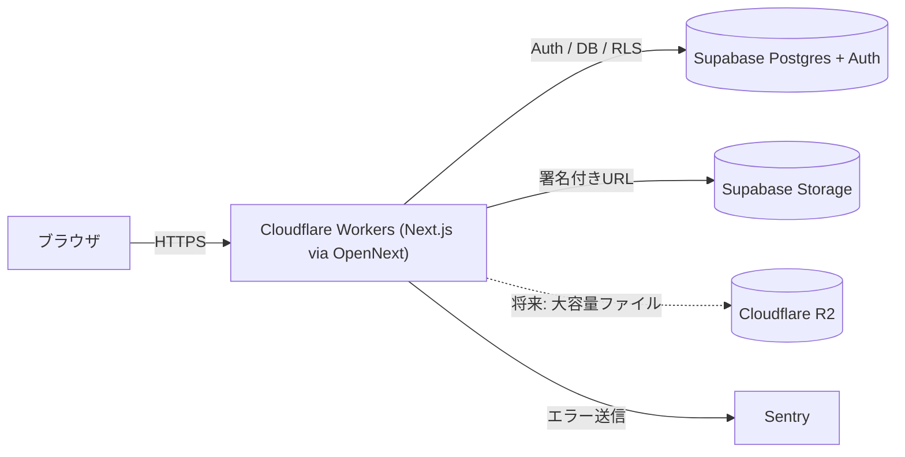

# Cueframe

音楽・映像制作物のレビュー〜納品を一元管理するWebアプリ。

音楽プロデューサー、MIXエンジニア、映像制作者とそのクライアントが、波形/映像上への時間指定コメント・バージョン比較・承認フローを一箇所で完結できることを目指しています。

> 個人開発のポートフォリオプロジェクトです。特定の勤務先・取引先のコード、デザイン、非公開仕様は一切参照・流用せず、一般的な制作レビュー業務のドメイン知識のみを前提にゼロから設計・実装しています。

## 主要機能（予定含む）

- 波形上へのタイムスタンプ付きコメント（wavesurfer.js）
- バージョン間のA/B比較再生
- ステータス管理(確認待ち / 修正中 / 承認済み)
- ロールベースの権限管理(client / creator / admin)とRLS
- タスク管理・締切ハイライト
- 期限付き共有URL(ログイン不要のゲストビュー)
- ダーク/ライトモード、モバイル対応、アクセシビリティ(AA)対応

## 技術スタック

| 領域 | 採用技術 |
| --- | --- |
| フレームワーク | Next.js (App Router) / React / TypeScript |
| DB | PostgreSQL (Supabase) |
| 認証・ストレージ | Supabase Auth / Supabase Storage |
| 波形描画 | wavesurfer.js v7 (Regions plugin) + Web Audio API |
| テスト | Vitest / React Testing Library / Playwright |
| コンポーネントカタログ | Storybook |
| エラー監視 | Sentry |
| CI | GitHub Actions |
| ホスティング | Cloudflare Workers ([OpenNext](https://opennext.js.org/cloudflare) アダプタ) |

### なぜこの構成か

- **Cloudflare Workers + OpenNext**: Next.jsのAPI Routes/Server ActionsをフルサポートしつつCloudflareのエッジ配信を活用するため。`@cloudflare/next-on-pages`は非推奨となったため、Cloudflareが公式に推奨する`@opennextjs/cloudflare`経由のWorkersデプロイを採用。
- **Supabase**: Auth・Postgres・Storage・Row Level Securityをワンストップで提供し、MVPの開発速度を優先。将来的な音声ファイル増大に備え、Cloudflare R2へのオフロードをストレッチゴールとして想定。
- **wavesurfer.js**: 波形描画とRegionsプラグインによるタイムスタンプコメントUIの実装コストを抑えるため。

## セットアップ

```bash
npm install
cp .env.example .env.local  # Supabase等の値を設定（Phase 1以降）
npm run dev
```

http://localhost:3000 を開く。

### 主なスクリプト

| スクリプト | 内容 |
| --- | --- |
| `npm run dev` | ローカル開発サーバー |
| `npm run lint` | ESLint |
| `npm run typecheck` | tsc --noEmit |
| `npm run build` | Next.jsプロダクションビルド |
| `npm run preview` | OpenNextでビルドし、Cloudflare Workersランタイムでローカルプレビュー |
| `npm run deploy` | OpenNextでビルドし、Cloudflare Workersへデプロイ |

## CI/CD構成

- **GitHub Actions - CI** ([.github/workflows/ci.yml](.github/workflows/ci.yml)): 全PRおよび`main`へのpushでlint / typecheck / buildを実行(Phase 6でユニットテスト・E2Eを追加予定)。
- **GitHub Actions - Deploy** ([.github/workflows/deploy.yml](.github/workflows/deploy.yml)): `main`のCIが成功した後に`opennextjs-cloudflare deploy`を実行しCloudflare Workersへデプロイ。リポジトリのSecretsに`CLOUDFLARE_API_TOKEN` / `CLOUDFLARE_ACCOUNT_ID`の設定が必要(未設定の間は失敗する)。
- **Cloudflareダッシュボード**: Workers & Pagesで本リポジトリをGit連携すると、PRごとにプレビューURLが自動発行される(手動設定が必要)。

## アーキテクチャ（概要）



## 実装フェーズ

- [x] Phase 0: プロジェクト初期化、Cloudflare Workersデプロイ疎通確認
- [ ] Phase 1: Supabase Auth、ロール設計、ダーク/ライトモード
- [ ] Phase 2: プロジェクトCRUD、ファイルアップロード、バージョン管理
- [ ] Phase 3: 波形描画、タイムスタンプコメント
- [ ] Phase 4: A/B比較再生、ステータス管理、コメント解決・絞り込み
- [ ] Phase 5: 権限管理(RLS)、タスク管理、共有URL
- [ ] Phase 6: テスト整備、Storybook、Sentry、CI/CD完成、a11y/レスポンシブ仕上げ

## スクリーンショット

準備中。

## ライセンス

[MIT](LICENSE)
