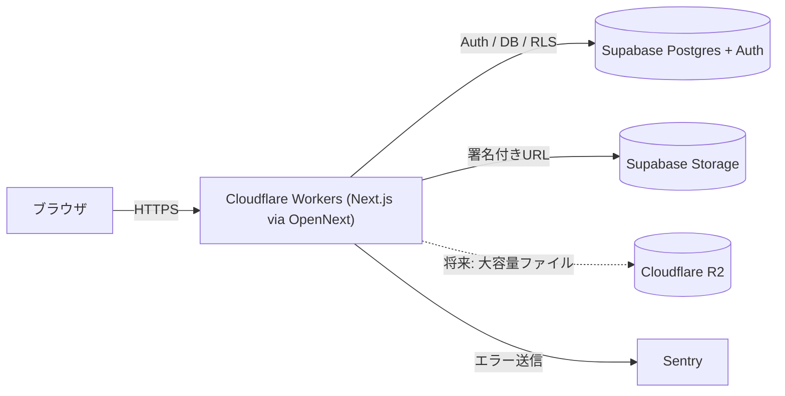

# Cueframe

音楽・映像制作物のレビュー〜納品を一元管理するWebアプリ。

音楽プロデューサー、MIXエンジニア、映像制作者とそのクライアントが、波形/映像上への時間指定コメント・バージョン比較・承認フローを一箇所で完結できることを目指しています。

> 個人開発のポートフォリオプロジェクトです。特定の勤務先・取引先のコード、デザイン、非公開仕様は一切参照・流用せず、一般的な制作レビュー業務のドメイン知識のみを前提にゼロから設計・実装しています。

## 主要機能（予定含む）

- 波形上へのタイムスタンプ付きコメント（wavesurfer.js）
- バージョン間のA/B比較再生
- ステータス管理(確認待ち / 修正中 / 承認済み)
- ロールベースの権限管理(client / creator / admin)とRLS
- タスク管理・締切ハイライト
- 期限付き共有URL(ログイン不要のゲストビュー)
- ダーク/ライトモード、モバイル対応、アクセシビリティ(AA)対応

## 技術スタック

| 領域 | 採用技術 |
| --- | --- |
| フレームワーク | Next.js (App Router) / React / TypeScript |
| DB | PostgreSQL (Supabase) |
| 認証・ストレージ | Supabase Auth / Supabase Storage |
| 波形描画 | wavesurfer.js v7 (Regions plugin) + Web Audio API |
| テスト | Vitest / React Testing Library / Playwright |
| コンポーネントカタログ | Storybook |
| エラー監視 | Sentry |
| CI | GitHub Actions |
| ホスティング | Cloudflare Workers ([OpenNext](https://opennext.js.org/cloudflare) アダプタ) |

### なぜこの構成か

- **Cloudflare Workers + OpenNext**: Next.jsのAPI Routes/Server ActionsをフルサポートしつつCloudflareのエッジ配信を活用するため。`@cloudflare/next-on-pages`は非推奨となったため、Cloudflareが公式に推奨する`@opennextjs/cloudflare`経由のWorkersデプロイを採用。
- **Supabase**: Auth・Postgres・Storage・Row Level Securityをワンストップで提供し、MVPの開発速度を優先。将来的な音声ファイル増大に備え、Cloudflare R2へのオフロードをストレッチゴールとして想定。
- **wavesurfer.js**: 波形描画とRegionsプラグインによるタイムスタンプコメントUIの実装コストを抑えるため。
- **共有ビューはSECURITY DEFINER RPC、service_role keyは不使用**: ログイン不要の共有ビューはRLSを迂回する必要があるが、`SUPABASE_SERVICE_ROLE_KEY`(RLSを全面バイパスする強力な鍵)をアプリに持ち込むのではなく、トークン検証込みのSECURITY DEFINER関数を個別に用意した。攻撃対象範囲を「そのRPCが返す範囲」だけに limitできる。
- **E2EはデフォルトのCIで実行しない**: 「アップロード→コメント→承認」を忠実に検証するには実際のSupabaseプロジェクトと2つの実アカウント(creator/client)が必要で、これをGitHub Secretsに常設するのは本番相当の認証情報をCIに置くことになり割に合わないと判断。ローカル実行かつ手動運用とし、その判断自体をこのREADMEに明記した。

## セットアップ

```bash
npm install
cp .env.example .env.local  # Supabase等の値を設定（Phase 1以降）
npm run dev
```

http://localhost:3000 を開く。

### Supabaseセットアップ(Phase 1〜)

1. [Supabase](https://supabase.com/dashboard) でプロジェクトを作成
2. Project Settings > API から `Project URL` と `anon public key` を取得し、`.env.local` に設定
3. SQL Editor で以下のマイグレーションを順番に実行
   - [supabase/migrations/0001_profiles.sql](supabase/migrations/0001_profiles.sql): `profiles` テーブル、ロール(`client`/`creator`/`admin`)、RLSポリシー、新規登録時の自動プロフィール作成トリガー
   - [supabase/migrations/0002_projects.sql](supabase/migrations/0002_projects.sql): `projects` / `versions` テーブル、RLS、`project-files` Storageバケットとそのアクセスポリシー
   - [supabase/migrations/0003_comments.sql](supabase/migrations/0003_comments.sql): `comments` テーブル(タイムスタンプ付きコメント)、RLS
   - [supabase/migrations/0004_membership.sql](supabase/migrations/0004_membership.sql): `project_members` / `project_invites`(招待リンク)、projects/versions/commentsのRLSをメンバー対応に拡張
   - [supabase/migrations/0005_tasks.sql](supabase/migrations/0005_tasks.sql): `tasks` テーブル、RLS
   - [supabase/migrations/0006_share_links.sql](supabase/migrations/0006_share_links.sql): `share_links`、ログイン不要のゲストビュー用SECURITY DEFINER RPC
   - [supabase/migrations/0007_fix_rls_recursion.sql](supabase/migrations/0007_fix_rls_recursion.sql): projects⇔project_membersのRLS循環参照を解消するSECURITY DEFINERヘルパー
   - [supabase/migrations/0008_project_members_insert.sql](supabase/migrations/0008_project_members_insert.sql): project_membersへのINSERTポリシー(招待経由の自己参加のみ許可)
   - [supabase/migrations/0009_profiles_shared_visibility.sql](supabase/migrations/0009_profiles_shared_visibility.sql): 同一プロジェクトのメンバー同士がお互いのプロフィールを閲覧できるように拡張
4. Authentication > Email のConfirm email設定に応じて、`/auth/confirm` がメール確認リンクの受け口になる

Supabase未設定の間もアプリ自体は起動する(認証関連の機能のみ「未設定」の案内を表示)。

### Sentryセットアップ(Phase 6〜・任意)

`NEXT_PUBLIC_SENTRY_DSN` が未設定の間は`sentry.*.config.ts`が自動的に無効化され(Supabase同様のグレースフルデグレード)、エラー監視なしで動作する。実際に有効化する場合は[Sentry](https://sentry.io)でNext.jsプロジェクトを作成し、`.env.local`にDSNを設定する。ソースマップアップロードには追加で`SENTRY_AUTH_TOKEN` / `SENTRY_ORG` / `SENTRY_PROJECT`が必要。

### 主なスクリプト

| スクリプト | 内容 |
| --- | --- |
| `npm run dev` | ローカル開発サーバー |
| `npm run lint` | ESLint |
| `npm run typecheck` | tsc --noEmit |
| `npm run test` | Vitestでユニットテストを実行 |
| `npm run test:watch` | Vitestをウォッチモードで実行 |
| `npm run test:e2e` | Playwrightで主要フローのE2Eテストを実行(要 [e2e/README.md](e2e/README.md) の環境変数) |
| `npm run storybook` | Storybookをローカル起動 |
| `npm run build-storybook` | Storybookの静的ビルド |
| `npm run build` | Next.jsプロダクションビルド |
| `npm run preview` | OpenNextでビルドし、Cloudflare Workersランタイムでローカルプレビュー |
| `npm run deploy` | OpenNextでビルドし、Cloudflare Workersへデプロイ |

## テスト構成

- **ユニットテスト(Vitest + React Testing Library)**: ステータス遷移の権限判定(`src/lib/permissions.ts`)、コメント解決フィルタ(`src/lib/comments.ts`)といったコアロジックを、SupabaseなどのI/Oから切り離した純粋関数として抽出しテスト。`StatusBadge`のコンポーネントテストも用意。
- **E2E(Playwright)**: [e2e/upload-comment-approve.spec.ts](e2e/upload-comment-approve.spec.ts)が実際のSupabaseプロジェクトに対し、2つの実アカウント(creator/client)を使って「プロジェクト作成→アップロード→波形上でコメント→招待→クライアントが承認」を一気通貫で検証する。実アカウントの認証情報が必要なため、デフォルトのCIでは実行せずローカル実行のみ(詳細は[e2e/README.md](e2e/README.md))。
- **Storybook**: `StatusBadge` / `ThemeToggle` / `ABPlayer` など、SupabaseやServer Actionsに依存しない主要コンポーネントにストーリーを用意。

## CI/CD構成

- **GitHub Actions - CI** ([.github/workflows/ci.yml](.github/workflows/ci.yml)): 全PRおよび`main`へのpushでlint / typecheck / test(Vitest) / buildを実行。
- **GitHub Actions - Deploy** ([.github/workflows/deploy.yml](.github/workflows/deploy.yml)): `main`のCIが成功した後に`opennextjs-cloudflare deploy`を実行しCloudflare Workersへデプロイ。リポジトリのSecretsに`CLOUDFLARE_API_TOKEN` / `CLOUDFLARE_ACCOUNT_ID`の設定が必要(未設定の間は失敗する)。
- **Cloudflareダッシュボード**: Workers & Pagesで本リポジトリをGit連携すると、PRごとにプレビューURLが自動発行される(手動設定が必要)。

## アーキテクチャ（概要）



## 実装フェーズ

- [x] Phase 0: プロジェクト初期化、Cloudflare Workersデプロイ疎通確認
- [x] Phase 1: Supabase Auth、ロール設計、ダーク/ライトモード
- [x] Phase 2: プロジェクトCRUD、ファイルアップロード、バージョン管理
- [x] Phase 3: 波形描画、タイムスタンプコメント
- [x] Phase 4: A/B比較再生、ステータス管理、コメント解決・絞り込み
- [x] Phase 5: 権限管理(RLS)、タスク管理、共有URL
- [x] Phase 6: テスト整備、Storybook、Sentry、CI/CD完成、a11y/レスポンシブ仕上げ

## スクリーンショット

準備中。

## ライセンス

[MIT](LICENSE)
